# Product Requirements Document (PRD)

## 1. INTRODUCTION

### 1.1 Purpose

This Product Requirements Document (PRD) defines the comprehensive requirements for the PSCompassOne PowerShell module, which provides programmatic access to Blackpoint's CompassOne cybersecurity platform. This document serves as the authoritative source of requirements for:

- Development team members implementing the PowerShell module
- Quality assurance engineers testing the implementation
- Technical writers creating documentation
- Project stakeholders evaluating feature completeness
- System administrators and DevOps engineers who will use the module

### 1.2 Scope

The PSCompassOne PowerShell module will provide:

- Native PowerShell cmdlets for all CompassOne REST API endpoints
- Secure authentication and configuration management
- Full support for asset, finding, incident, and relationship management
- Comprehensive error handling and logging capabilities
- Pipeline-compatible data structures
- Cross-platform compatibility (Windows, Linux, macOS)
- Standard PowerShell help system integration

Key features include:

- Asset Management
  - Create, read, update, and delete operations for all asset types
  - Asset relationship mapping
  - Tag management
  - Bulk operations support

- Security Operations
  - Alert and event monitoring
  - Incident management
  - Finding correlation
  - Note management

- Administrative Functions
  - Configuration management
  - Authentication handling
  - Tenant management
  - Audit logging

The module will follow PowerShell best practices and conventions while providing a natural interface to CompassOne's functionality for automation and scripting scenarios.

### 1.3 Definitions and Acronyms

| Term | Definition |
|------|------------|
| API | Application Programming Interface |
| CRUD | Create, Read, Update, Delete |
| PRD | Product Requirements Document |
| REST | Representational State Transfer |
| SOC | Security Operations Center |
| MVP | Minimum Viable Product |

### 1.4 References

- PowerShell Module Development Guidelines
- CompassOne REST API Specification
- PowerShell Security Best Practices
- Microsoft.PowerShell.SecretStore Documentation
- Pester Testing Framework Documentation

### 1.5 Document Conventions

This document uses:

- SHALL/MUST: Mandatory requirements
- SHOULD: Recommended but not mandatory features
- MAY: Optional features
- Code blocks: For example implementations and specifications
- Tables: For structured data and comparisons
- Lists: For requirements and feature sets

## 2. PRODUCT DESCRIPTION

### 2.1 Product Perspective

The PSCompassOne PowerShell module operates as a client-side integration component within the larger CompassOne cybersecurity ecosystem. It interfaces directly with CompassOne's REST API endpoints to provide PowerShell-native access to the platform's functionality.

Key integration points include:

- CompassOne REST API
  - Authentication and authorization
  - Asset management endpoints
  - Finding and incident endpoints
  - Relationship management endpoints
  - Tag management endpoints

- PowerShell Environment
  - PowerShell 5.1+ runtime
  - Standard PowerShell module infrastructure
  - PowerShell Gallery distribution system
  - PowerShell security and configuration systems

- Enterprise Security Tools
  - Security Information and Event Management (SIEM) systems
  - Asset management databases
  - Automation workflows
  - Incident response platforms

### 2.2 Product Functions

The module provides the following core functions:

1. Asset Management
   - Create, read, update, and delete assets
   - Asset classification and tagging
   - Asset relationship mapping
   - Asset inventory reporting

2. Security Operations
   - Alert monitoring and management
   - Incident creation and tracking
   - Finding correlation and analysis
   - Note management and documentation

3. Configuration Management
   - API connection configuration
   - Authentication token management
   - Module settings persistence
   - Cross-platform configuration support

4. Integration Support
   - Pipeline-compatible cmdlets
   - Batch operation capabilities
   - Data export/import functionality
   - Error handling and logging

### 2.3 User Characteristics

Primary user personas include:

1. Security Engineers
   - Advanced PowerShell expertise
   - Deep security domain knowledge
   - Focus on automation and integration
   - Need for bulk operations and reporting

2. System Administrators
   - Moderate PowerShell knowledge
   - Basic security understanding
   - Regular asset management tasks
   - Configuration and maintenance focus

3. DevOps Engineers
   - Strong automation expertise
   - CI/CD pipeline integration needs
   - Cross-platform requirements
   - High-volume operation requirements

4. Security Analysts
   - Basic PowerShell familiarity
   - Strong security analysis skills
   - Incident response focus
   - Reporting and documentation needs

### 2.4 Constraints

1. Technical Constraints
   - Must support PowerShell 5.1 minimum
   - Must handle API rate limiting
   - Must operate within memory constraints
   - Must support cross-platform execution

2. Security Constraints
   - Must follow PowerShell security best practices
   - Must protect authentication credentials
   - Must validate all API inputs
   - Must maintain audit trails

3. Operational Constraints
   - Must support concurrent operations
   - Must handle network interruptions
   - Must provide progress feedback
   - Must maintain backward compatibility

4. Regulatory Constraints
   - Must support compliance reporting
   - Must maintain data privacy
   - Must enable audit logging
   - Must support access controls

### 2.5 Assumptions and Dependencies

1. Assumptions
   - Users have basic PowerShell knowledge
   - Network access to CompassOne API
   - Sufficient system resources
   - Valid API credentials available

2. Dependencies
   - CompassOne API availability
   - PowerShell runtime environment
   - .NET Framework/Core
   - Required PowerShell modules:
     - Microsoft.PowerShell.SecretStore
     - Microsoft.PowerShell.Security
     - PowerShellGet (for installation)

3. External Systems
   - Authentication providers
   - Network infrastructure
   - DNS resolution
   - Time synchronization

4. Development Dependencies
   - Source control system
   - CI/CD pipeline
   - Testing infrastructure
   - Documentation platform

## 3. PROCESS FLOWCHART

```mermaid
flowchart TD
    A[API Request] --> B{Request Type}
    
    B -->|GET| C[Build Query]
    C --> C1[Add Parameters]
    C1 --> C2[Add Pagination]
    C2 --> C3[Add Sorting]
    
    B -->|POST/PUT| D[Build Body]
    D --> D1[Validate Input]
    D1 --> D2[Convert to JSON]
    
    B -->|DELETE| E[Build Path]
    
    C3 & D2 & E --> F[Add Headers]
    F --> G[Add Authentication]
    
    G --> H[Send Request]
    H --> I{Response Code}
    
    I -->|200-299| J[Success]
    J --> K[Parse Response]
    K --> L[Convert to Objects]
    
    I -->|400| M[Bad Request]
    I -->|401| N[Unauthorized]
    I -->|403| O[Forbidden]
    I -->|404| P[Not Found]
    I -->|429| Q[Rate Limited]
    I -->|500| R[Server Error]
    
    M & N & O & P & Q & R --> S[Generate Error]
    S --> T[Add Context]
    
    L --> U[Return Result]
    T --> V[Throw Error]
```





## 4. FUNCTIONAL REQUIREMENTS

### 4.1 Asset Management

#### ID: F-ASSET-001
#### Description
Provides complete CRUD operations for managing assets in the CompassOne platform through PowerShell cmdlets.
#### Priority: High

| Requirement ID | Requirement Description | Acceptance Criteria |
|----------------|------------------------|-------------------|
| F-ASSET-001.1 | Get-Asset cmdlet must retrieve assets with filtering and pagination | - Supports ID parameter for single asset retrieval<br>- Implements standard pagination parameters<br>- Returns properly typed asset objects<br>- Handles all asset classes correctly |
| F-ASSET-001.2 | New-Asset cmdlet must create assets with proper validation | - Validates required fields by asset class<br>- Accepts pipeline input<br>- Returns created asset object<br>- Handles all asset classes |
| F-ASSET-001.3 | Set-Asset cmdlet must update existing assets | - Validates asset ID exists<br>- Updates only specified fields<br>- Returns updated asset object<br>- Preserves unmodified fields |
| F-ASSET-001.4 | Remove-Asset cmdlet must handle asset deletion | - Supports soft delete<br>- Validates asset exists<br>- Returns success/failure status<br>- Handles dependencies properly |

### 4.2 Finding Management

#### ID: F-FIND-001
#### Description
Enables management of security findings including alerts, events and incidents through PowerShell cmdlets.
#### Priority: High

| Requirement ID | Requirement Description | Acceptance Criteria |
|----------------|------------------------|-------------------|
| F-FIND-001.1 | Get-Finding cmdlet must retrieve findings with filtering | - Supports finding class filtering<br>- Implements pagination<br>- Returns typed finding objects<br>- Handles all finding types |
| F-FIND-001.2 | New-Finding cmdlet must create findings | - Validates finding class requirements<br>- Sets required metadata<br>- Returns created finding object<br>- Supports all finding types |
| F-FIND-001.3 | Set-Finding cmdlet must update findings | - Validates finding exists<br>- Updates specified fields only<br>- Returns updated finding<br>- Preserves existing data |
| F-FIND-001.4 | Remove-Finding cmdlet must handle deletion | - Implements soft delete<br>- Validates finding exists<br>- Returns operation status<br>- Handles relationships |

### 4.3 Relationship Management

#### ID: F-REL-001
#### Description
Manages relationships between assets and findings through PowerShell cmdlets.
#### Priority: Medium

| Requirement ID | Requirement Description | Acceptance Criteria |
|----------------|------------------------|-------------------|
| F-REL-001.1 | Get-Relationship cmdlet must retrieve relationships | - Supports directional queries<br>- Implements filtering<br>- Returns relationship objects<br>- Includes related entities |
| F-REL-001.2 | New-Relationship cmdlet must create relationships | - Validates entity existence<br>- Sets required metadata<br>- Returns created relationship<br>- Handles all relationship types |
| F-REL-001.3 | Set-Relationship cmdlet must update relationships | - Validates relationship exists<br>- Updates specified fields<br>- Returns updated relationship<br>- Maintains integrity |
| F-REL-001.4 | Remove-Relationship cmdlet must handle deletion | - Validates relationship exists<br>- Implements soft delete<br>- Returns operation status<br>- Updates related entities |

### 4.4 Tag Management

#### ID: F-TAG-001
#### Description
Provides tag management capabilities through PowerShell cmdlets.
#### Priority: Medium

| Requirement ID | Requirement Description | Acceptance Criteria |
|----------------|------------------------|-------------------|
| F-TAG-001.1 | Get-Tag cmdlet must retrieve tags | - Supports filtering<br>- Implements pagination<br>- Returns tag objects<br>- Includes usage metadata |
| F-TAG-001.2 | New-Tag cmdlet must create tags | - Validates tag name uniqueness<br>- Sets required metadata<br>- Returns created tag<br>- Handles scope properly |
| F-TAG-001.3 | Set-Tag cmdlet must update tags | - Validates tag exists<br>- Updates specified fields<br>- Returns updated tag<br>- Maintains relationships |
| F-TAG-001.4 | Remove-Tag cmdlet must handle deletion | - Validates tag exists<br>- Removes tag assignments<br>- Returns operation status<br>- Updates tagged entities |

### 4.5 Configuration Management

#### ID: F-CONFIG-001
#### Description
Manages module configuration and authentication through PowerShell cmdlets.
#### Priority: High

| Requirement ID | Requirement Description | Acceptance Criteria |
|----------------|------------------------|-------------------|
| F-CONFIG-001.1 | Set-PSCompassOneConfiguration cmdlet must store settings | - Supports multiple storage methods<br>- Encrypts sensitive data<br>- Validates configuration<br>- Returns operation status |
| F-CONFIG-001.2 | Get-PSCompassOneConfiguration cmdlet must retrieve settings | - Retrieves from all sources<br>- Decrypts secure data<br>- Returns configuration object<br>- Handles missing config |
| F-CONFIG-001.3 | Remove-PSCompassOneConfiguration cmdlet must clear settings | - Removes from all locations<br>- Securely deletes tokens<br>- Returns operation status<br>- Updates session state |
| F-CONFIG-001.4 | Test-PSCompassOneConnection cmdlet must validate connectivity | - Validates credentials<br>- Tests API access<br>- Returns detailed status<br>- Handles errors properly |

### 4.6 Pipeline Support

#### ID: F-PIPE-001
#### Description
Implements PowerShell pipeline support across all cmdlets.
#### Priority: High

| Requirement ID | Requirement Description | Acceptance Criteria |
|----------------|------------------------|-------------------|
| F-PIPE-001.1 | All Get cmdlets must support pipeline output | - Returns pipeline-compatible objects<br>- Includes type information<br>- Supports Select-Object<br>- Enables chaining |
| F-PIPE-001.2 | All Set/New cmdlets must accept pipeline input | - Accepts pipeline by property name<br>- Handles bulk operations<br>- Provides progress feedback<br>- Maintains consistency |
| F-PIPE-001.3 | All Remove cmdlets must accept pipeline input | - Accepts pipeline by property name<br>- Supports bulk deletion<br>- Shows progress for large sets<br>- Handles errors properly |
| F-PIPE-001.4 | All cmdlets must implement proper pipeline processing | - Implements begin/process/end blocks<br>- Handles streaming properly<br>- Supports pipeline stopping<br>- Manages resources correctly |

## 5. NON-FUNCTIONAL REQUIREMENTS

### 5.1 Performance Requirements

| Requirement | Description | Target Metric |
|-------------|-------------|---------------|
| Response Time | Maximum time for cmdlet execution | < 2 seconds for simple operations<br>< 10 seconds for bulk operations |
| Throughput | Number of concurrent operations | Minimum 10 parallel requests |
| Memory Usage | Maximum memory consumption | < 100MB base memory<br>< 500MB during bulk operations |
| CPU Usage | Maximum processor utilization | < 30% for single operations<br>< 70% for bulk operations |
| Network Efficiency | Bandwidth optimization | Compression for responses > 1MB<br>Connection pooling enabled |

### 5.2 Safety Requirements

| Requirement | Description | Implementation |
|-------------|-------------|----------------|
| Data Backup | Protection against data loss | Automatic backup of configuration<br>Transaction logging for critical operations |
| Error Recovery | Graceful handling of failures | Automatic retry for transient failures<br>Session state preservation<br>Rollback capabilities for failed operations |
| Resource Protection | Prevention of resource exhaustion | Memory usage limits<br>Connection pooling<br>Automatic cleanup of stale resources |
| Operation Validation | Prevention of harmful operations | Parameter validation<br>Confirmation prompts for destructive operations<br>Dry-run capability for bulk operations |

### 5.3 Security Requirements

| Requirement | Description | Implementation |
|-------------|-------------|----------------|
| Authentication | Secure credential handling | Microsoft.PowerShell.SecretStore integration<br>Secure string for token storage<br>Environment variable support |
| Authorization | Access control | Role-based command restrictions<br>Scope-based operation limits<br>Tenant isolation |
| Data Protection | Secure data handling | TLS 1.2+ for all communications<br>At-rest encryption for stored credentials<br>Secure memory handling |
| Audit Trail | Security event logging | Operation logging<br>Error tracking<br>Authentication attempts recording |

### 5.4 Quality Requirements

#### 5.4.1 Availability
- Minimum 99.9% uptime for module operations
- Automatic failover for API endpoints
- Graceful degradation during partial outages

#### 5.4.2 Maintainability
- Modular architecture with clear separation of concerns
- Comprehensive inline documentation
- Standard PowerShell code formatting
- Automated testing coverage > 90%

#### 5.4.3 Usability
- Consistent command naming conventions
- Comprehensive help documentation
- Tab completion support
- Intuitive parameter names and types

#### 5.4.4 Scalability
- Support for large dataset pagination
- Batch operation capabilities
- Resource usage optimization
- Connection pooling

#### 5.4.5 Reliability
- Automatic retry for transient failures
- Consistent error handling
- Data validation at all levels
- Transaction integrity preservation

### 5.5 Compliance Requirements

| Requirement | Standard/Regulation | Implementation |
|-------------|-------------------|----------------|
| Code Standards | PowerShell Best Practices | PSScriptAnalyzer validation<br>Style guide compliance<br>Naming conventions |
| Security Standards | OWASP Security Guidelines | Secure communication<br>Input validation<br>Output encoding |
| Data Privacy | GDPR/CCPA | Data minimization<br>Secure storage<br>Audit logging |
| Industry Standards | ISO 27001 | Security controls<br>Risk management<br>Documentation requirements |

## 6. DATA REQUIREMENTS

### 6.1 Data Models

The PSCompassOne module handles the following core data entities and their relationships:


### 6.2 Data Storage

#### 6.2.1 Local Configuration Storage

- Configuration data stored using Microsoft.PowerShell.SecretStore
- Encrypted credentials and tokens
- Local caching of frequently accessed data
- Cross-platform storage locations:
  - Windows: %APPDATA%\PSCompassOne
  - Linux/macOS: ~/.config/PSCompassOne

#### 6.2.2 Data Retention

| Data Type | Retention Period | Storage Location | Encryption |
|-----------|------------------|------------------|------------|
| API Tokens | Until revoked | SecretStore | AES-256 |
| Session Cache | Current session | Memory | In-memory only |
| Audit Logs | 90 days | Local filesystem | None |
| Error Logs | 30 days | Local filesystem | None |

#### 6.2.3 Backup and Recovery

- Automatic backup of configuration before changes
- Configuration export/import capabilities
- Session state preservation for recovery
- Transaction logging for critical operations

### 6.3 Data Processing

#### 6.3.1 Data Flow


#### 6.3.2 Data Security

| Security Layer | Implementation |
|----------------|----------------|
| Transport | TLS 1.2+ for all API communications |
| Authentication | OAuth2 tokens stored in SecretStore |
| Authorization | Role-based access control via API |
| Data at Rest | AES-256 encryption for stored credentials |
| Input Validation | Parameter validation sets and regex patterns |
| Output Sanitization | HTML/JSON encoding for displayed data |

#### 6.3.3 Data Transformation


### 6.4 Data Validation

| Data Type | Validation Rules | Error Handling |
|-----------|------------------|----------------|
| Asset IDs | UUID format | ThrowTerminatingError |
| Dates | ISO 8601 format | Write-Error |
| Enums | ValidateSet attribute | Parameter validation |
| Numbers | Range validation | Parameter validation |
| Strings | Length and pattern | Parameter validation |

### 6.5 Data Integration

#### 6.5.1 Input/Output Formats

- JSON for API communication
- CSV for bulk operations
- PowerShell objects for pipeline
- Custom formats for display

#### 6.5.2 Data Mapping

| Source Format | Target Format | Transformation |
|---------------|---------------|----------------|
| JSON Response | PSObject | ConvertFrom-Json |
| CSV Input | API Request | Import-Csv pipeline |
| Pipeline Input | API Request | Parameter binding |
| API Response | Pipeline Output | Type conversion |

## 7. EXTERNAL INTERFACES

### 7.1 User Interfaces

The PSCompassOne module follows standard PowerShell command-line interface conventions:

#### 7.1.1 Command Structure

```powershell
# Standard command format
Verb-PSCompassOneNoun [-Parameter] <required> [-OptionalParameter value]

# Example commands
Get-PSCompassOneAsset -Id "123"
New-PSCompassOneIncident -Name "Security Event" -TicketId "INC123"
```

#### 7.1.2 Output Formats

| Format Type | Description | Example Usage |
|-------------|-------------|---------------|
| Default View | Formatted table output | `Get-PSCompassOneAsset` |
| List View | Detailed single-item view | `Get-PSCompassOneAsset -Id "123" \| Format-List` |
| Grid View | Interactive grid display | `Get-PSCompassOneAsset \| Out-GridView` |
| Custom Format | User-defined format | `Get-PSCompassOneAsset \| Format-Table Name,Id,Status` |

#### 7.1.3 Progress Indicators

```powershell
# Progress bar for long-running operations
Write-Progress -Activity "Retrieving assets" -Status "Page $currentPage of $totalPages" -PercentComplete $percent
```

### 7.2 Software Interfaces

#### 7.2.1 CompassOne REST API Integration

| Interface Component | Specification |
|--------------------|---------------|
| Protocol | HTTPS |
| Authentication | API Key in header |
| Content Type | application/json |
| Rate Limiting | Exponential backoff |
| Pagination | Server-side, max 50 items |

#### 7.2.2 PowerShell Integration Points


#### 7.2.3 Required PowerShell Modules

| Module Name | Version | Purpose |
|-------------|---------|----------|
| Microsoft.PowerShell.SecretStore | 1.0.0+ | Credential storage |
| Microsoft.PowerShell.Security | Built-in | Certificate handling |
| Microsoft.PowerShell.Management | Built-in | File operations |

### 7.3 Communication Interfaces

#### 7.3.1 Network Protocol Requirements

| Protocol | Port | Usage | Security |
|----------|------|-------|----------|
| HTTPS | 443 | API Communication | TLS 1.2+ |
| DNS | 53 | Name Resolution | Standard |
| HTTP Proxy | Configurable | Optional proxy support | Proxy authentication |

#### 7.3.2 Data Exchange Formats

```json
{
    "request": {
        "headers": {
            "Accept": "application/json",
            "Content-Type": "application/json",
            "Authorization": "Bearer {token}"
        },
        "body": {
            "data": {}
        }
    },
    "response": {
        "data": {},
        "meta": {
            "pagination": {
                "page": 1,
                "pageSize": 50,
                "total": 100
            }
        }
    }
}
```

#### 7.3.3 Error Communication

| Error Type | HTTP Code | PowerShell Handling |
|------------|-----------|-------------------|
| Authentication | 401 | ThrowTerminatingError |
| Authorization | 403 | ThrowTerminatingError |
| Not Found | 404 | Write-Error |
| Rate Limit | 429 | Write-Warning + Retry |
| Server Error | 500 | Write-Error + Retry |

#### 7.3.4 Retry Logic


### 7.4 Security Interfaces

#### 7.4.1 Authentication Methods

| Method | Implementation | Storage |
|--------|---------------|---------|
| API Key | HTTPS Header | SecretStore |
| OAuth Token | Bearer Token | SecretStore |
| Certificate | Client Certificate | Certificate Store |

#### 7.4.2 Encryption Requirements

| Data Type | Encryption Method | Key Storage |
|-----------|------------------|-------------|
| Credentials | AES-256 | SecretStore |
| Configuration | DPAPI | User Profile |
| Tokens | AES-256 | SecretStore |

#### 7.4.3 Audit Logging Interface

```powershell
# Standard log format
$logEntry = @{
    Timestamp = [DateTime]::UtcNow
    Operation = $operation
    User = $env:USERNAME
    Status = $status
    Details = $details
}
```

## 8. APPENDICES

### 8.1 GLOSSARY

| Term | Definition |
|------|------------|
| Asset | Any entity tracked in CompassOne (devices, users, software, etc.) |
| Finding | Security-related discovery (alert, event, incident) |
| Relationship | Connection between two entities in the system |
| Tag | Label used to categorize and group entities |
| Tenant | Isolated customer environment within CompassOne |
| Pipeline | PowerShell's object streaming mechanism |
| Cmdlet | Native PowerShell command |
| Parameter Set | Group of parameters that can be used together |
| Verb-Noun | PowerShell's standard command naming convention |

### 8.2 ACRONYMS

| Acronym | Definition |
|---------|------------|
| API | Application Programming Interface |
| BYOD | Bring Your Own Device |
| COTS | Commercial Off-The-Shelf |
| CRUD | Create, Read, Update, Delete |
| DPAPI | Data Protection Application Programming Interface |
| FOSS | Free and Open Source Software |
| FQDN | Fully Qualified Domain Name |
| HIPAA | Health Insurance Portability and Accountability Act |
| IP | Internet Protocol |
| MAC | Media Access Control |
| MFA | Multi-Factor Authentication |
| OS | Operating System |
| PID | Process Identifier |
| PPID | Parent Process Identifier |
| PRD | Product Requirements Document |
| REST | Representational State Transfer |
| SOC | Security Operations Center |
| TLS | Transport Layer Security |
| UUID | Universally Unique Identifier |

### 8.3 ADDITIONAL REFERENCES

#### 8.3.1 PowerShell Development

- [PowerShell Module Development Guidelines](https://learn.microsoft.com/en-us/powershell/scripting/developer/module/writing-a-windows-powershell-module)
- [PowerShell Approved Verbs](https://learn.microsoft.com/en-us/powershell/scripting/developer/cmdlet/approved-verbs-for-windows-powershell-commands)
- [PowerShell Code Style Guide](https://github.com/PoshCode/PowerShellPracticeAndStyle)
- [Pester Testing Framework Documentation](https://pester.dev/docs/quick-start)

#### 8.3.2 Security Standards

- [OWASP API Security Top 10](https://owasp.org/www-project-api-security/)
- [PowerShell Security Best Practices](https://learn.microsoft.com/en-us/powershell/scripting/learn/security-features)
- [Microsoft.PowerShell.SecretStore Documentation](https://learn.microsoft.com/en-us/powershell/module/microsoft.powershell.secretstore)
- [PowerShell Security Module Documentation](https://learn.microsoft.com/en-us/powershell/module/microsoft.powershell.security)

#### 8.3.3 API Documentation

- [CompassOne REST API Specification](https://api.compassone.com/docs)
- [OpenAPI/Swagger Documentation](https://swagger.io/docs/)
- [REST API Design Best Practices](https://learn.microsoft.com/en-us/azure/architecture/best-practices/api-design)
- [API Rate Limiting Patterns](https://learn.microsoft.com/en-us/azure/architecture/patterns/rate-limiting-pattern)

#### 8.3.4 Development Tools

- [Visual Studio Code PowerShell Extension](https://marketplace.visualstudio.com/items?itemName=ms-vscode.PowerShell)
- [PSScriptAnalyzer Documentation](https://github.com/PowerShell/PSScriptAnalyzer)
- [platyPS Documentation](https://github.com/PowerShell/platyPS)
- [PowerShell Gallery Publishing Guidelines](https://learn.microsoft.com/en-us/powershell/scripting/gallery/how-to/publishing-packages)

### 8.4 CHANGE LOG

| Version | Date | Author | Description |
|---------|------|--------|-------------|
| 1.0.0 | Initial | - | Initial PRD creation |

### 8.5 APPENDIX NOTES

1. Asset Classes
   - CONTAINER
   - DEVICE
   - FRAMEWORK
   - NETSTAT
   - PERSON
   - PROCESS
   - SERVICE
   - SOFTWARE
   - SOURCE
   - SURVEY
   - USER

2. Finding Classes
   - ALERT
   - EVENT
   - INCIDENT

3. Relationship Types
   - Explicit
   - Implicit

4. Relationship Verbs
   - Connects
   - Has

5. Note Access Levels
   - CUSTOMER
   - INTERNAL
   - PARTNER
   - SELF