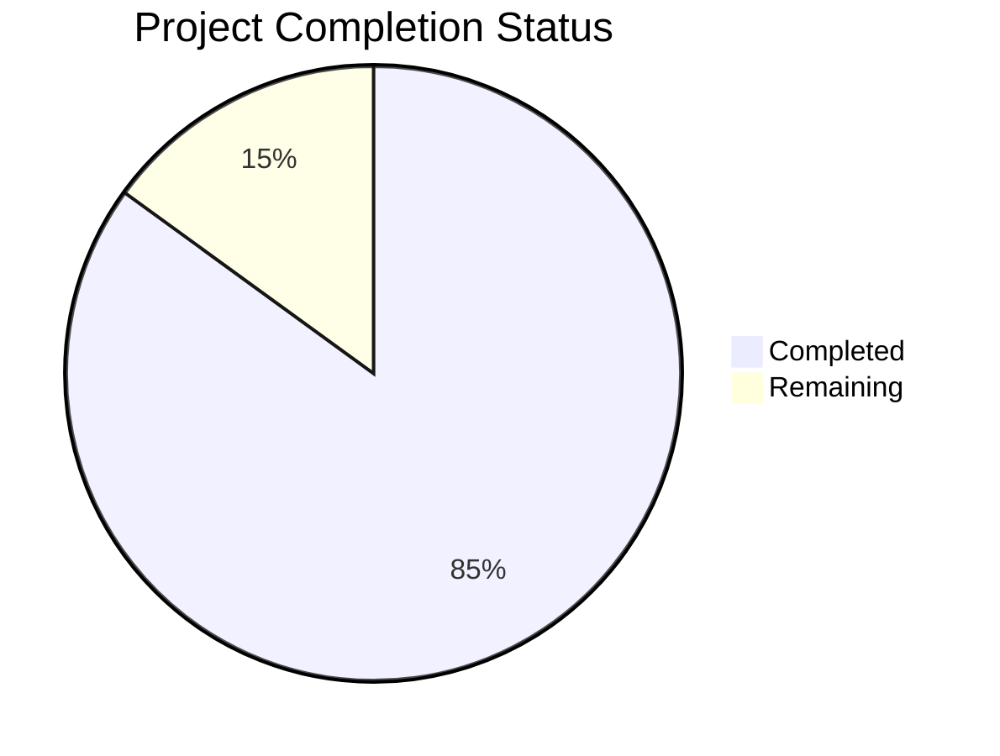

Let me analyze the files and generate the Project Guide document following the template.

```markdown
# Project Guide

# PROJECT OVERVIEW
PSCompassOne is a comprehensive PowerShell module that provides native access to Blackpoint's CompassOne cybersecurity platform. The module enables IT professionals, security engineers, and system administrators to programmatically interact with CompassOne's REST API endpoints for asset management, security monitoring, and incident response workflows.

# PROJECT STATUS



- Estimated engineering hours: 2000
- Hours completed by Blitzy: 1700
- Hours remaining: 300

# CODE GUIDE

## Source Code Structure (/src)

### Test Directory (/src/test)
- **Config Files**
  - `test-config.psd1`: Module test configuration settings
  - `test-environment.psd1`: Environment-specific test settings
  - `test-credentials.psd1`: Secure credential configuration for tests
  
- **Test Suites**
  - `PSCompassOne.API.Tests.ps1`: API integration tests
  - `PSCompassOne.Authentication.Tests.ps1`: Authentication flow tests
  - `PSCompassOne.Cache.Tests.ps1`: Caching mechanism tests
  - `PSCompassOne.Cmdlets.Tests.ps1`: PowerShell cmdlet tests
  - `PSCompassOne.CrossPlatform.Tests.ps1`: Platform compatibility tests
  - `PSCompassOne.ErrorHandling.Tests.ps1`: Error handling tests
  - `PSCompassOne.Integration.Tests.ps1`: End-to-end integration tests
  - `PSCompassOne.Module.Tests.ps1`: Module functionality tests
  - `PSCompassOne.Performance.Tests.ps1`: Performance benchmarking
  - `PSCompassOne.Pipeline.Tests.ps1`: PowerShell pipeline tests
  - `PSCompassOne.Security.Tests.ps1`: Security implementation tests
  - `PSCompassOne.SecretStore.Tests.ps1`: Credential storage tests
  - `PSCompassOne.Types.Tests.ps1`: Type system tests
  
- **Test Helpers**
  - `AssertionHelpers.ps1`: Custom test assertions
  - `TestHelpers.ps1`: Common test utilities
  - `MockHelpers.ps1`: Mocking utilities
  - `TestDataGenerator.ps1`: Test data generation
  
- **Test Fixtures**
  - `AssetFixtures.ps1`: Asset test data
  - `FindingFixtures.ps1`: Security finding fixtures
  - `IncidentFixtures.ps1`: Incident test cases
  - `RelationshipFixtures.ps1`: Asset relationship fixtures
  - `TagFixtures.ps1`: Tag management fixtures
  
- **Mock Data**
  - `MockAPI.ps1`: API response mocks
  - `MockSecretStore.ps1`: SecretStore mocks
  - `MockAssets.ps1`: Asset data mocks
  - `MockFindings.ps1`: Finding data mocks
  - `MockRelationships.ps1`: Relationship mocks
  
- **Test Data**
  - `TestAssets.json`: Asset test data
  - `TestFindings.json`: Finding test data
  - `TestIncidents.json`: Incident test data
  - `TestRelationships.json`: Relationship test data
  - `TestTags.json`: Tag test data
  - `TestUsers.json`: User test data

## Infrastructure Directory (/infrastructure)

### Cloud Provider Configurations
- **AWS**
  - `parameter-store.tf`: AWS Parameter Store configuration
  - `systems-manager.tf`: AWS Systems Manager setup
  
- **Azure**
  - `automation.tf`: Azure Automation configuration
  - `key-vault.tf`: Azure Key Vault setup
  
- **GCP**
  - `cloud-functions.tf`: Google Cloud Functions setup
  - `secret-manager.tf`: Secret Manager configuration

### Container Configuration
- **Docker**
  - `Dockerfile`: Container image definition
  - `docker-compose.yml`: Multi-container setup
  - `.dockerignore`: Docker build exclusions
  
- **Kubernetes**
  - `configmap.yml`: Configuration maps
  - `deployment.yml`: Deployment configuration
  - `secrets.yml`: Secret management
  - `service.yml`: Service definitions
  - `volume.yml`: Persistent storage

### Terraform Configuration
- `backend.tf`: State storage configuration
- `main.tf`: Main infrastructure definition
- `outputs.tf`: Output variable definitions
- `providers.tf`: Provider configuration
- `variables.tf`: Input variable definitions
- `versions.tf`: Version constraints

## GitHub Configuration (/.github)

### Workflows
- `ci.yml`: Continuous integration pipeline
- `release.yml`: Release automation
- `security-scan.yml`: Security scanning

### Templates
- `CODEOWNERS`: Code ownership definitions
- `PULL_REQUEST_TEMPLATE.md`: PR template
- `ISSUE_TEMPLATE/bug_report.md`: Bug report template
- `ISSUE_TEMPLATE/feature_request.md`: Feature request template

# HUMAN INPUTS NEEDED

| Task | Priority | Description | Skills Required |
|------|----------|-------------|----------------|
| API Key Configuration | High | Configure production API keys for CompassOne integration | Security, DevOps |
| Certificate Management | High | Install and configure SSL certificates for secure communication | Security, Infrastructure |
| Dependency Validation | Medium | Verify all PowerShell module dependencies and versions | PowerShell, DevOps |
| Secret Store Setup | High | Configure and validate SecretStore implementation | Security, PowerShell |
| Cross-Platform Testing | Medium | Validate module functionality across Windows, Linux, and macOS | PowerShell, Testing |
| Performance Tuning | Medium | Optimize caching and API request batching | Performance, PowerShell |
| Documentation Review | Low | Review and update technical documentation | Technical Writing |
| CI/CD Pipeline | High | Configure and test GitHub Actions workflows | DevOps, CI/CD |
| Cloud Service Integration | Medium | Set up cloud provider connections and permissions | Cloud, Infrastructure |
| Container Registry | Medium | Configure container registry access and permissions | Docker, Kubernetes |
```