# Technical Specifications

# 1. INTRODUCTION

## 1.1 EXECUTIVE SUMMARY

The PSCompassOne PowerShell module provides native PowerShell access to Blackpoint's CompassOne cybersecurity platform through a comprehensive set of cmdlets. This module enables IT professionals, security engineers, and system administrators to programmatically interact with CompassOne's REST API endpoints for asset management, security monitoring, and incident response workflows. By eliminating the need for custom API integration code, the module significantly reduces implementation time and standardizes interaction patterns across organizations.

The module addresses the critical need for automated security operations and infrastructure management while maintaining compliance with PowerShell best practices and security standards. Primary stakeholders include security teams, IT operations, and DevOps engineers who require programmatic access to CompassOne's capabilities.

## 1.2 SYSTEM OVERVIEW

### Project Context

| Aspect | Description |
|--------|-------------|
| Business Context | Enables programmatic access to CompassOne platform capabilities through PowerShell |
| Market Position | First official PowerShell integration for CompassOne platform |
| Current Limitations | Manual API integration required for PowerShell automation |
| Enterprise Integration | Fits into existing PowerShell automation workflows and security toolchains |

### High-Level Description

| Component | Description |
|-----------|-------------|
| Core Capabilities | - Asset inventory management<br>- Security posture monitoring<br>- Incident response automation<br>- Relationship mapping<br>- Tag management |
| Architecture | - PowerShell module structure<br>- REST API integration<br>- Secure credential management<br>- Cross-platform compatibility |
| Technical Approach | - Standard PowerShell module patterns<br>- Object-oriented cmdlet design<br>- Pipeline-enabled operations<br>- Comprehensive error handling |

### Success Criteria

| Metric | Target |
|--------|--------|
| Installation Success | >95% successful installations via PowerShell Gallery |
| API Coverage | 100% of documented CompassOne REST endpoints |
| Performance | <2s response time for single operations |
| Error Handling | >95% of errors properly caught and handled |

## 1.3 SCOPE

### In-Scope Elements

#### Core Features

| Category | Features |
|----------|----------|
| Asset Management | - CRUD operations for all asset types<br>- Bulk asset operations<br>- Asset relationship management<br>- Tag management |
| Security Operations | - Alert monitoring<br>- Incident management<br>- Finding correlation<br>- Note management |
| Authentication | - API key management<br>- Secure credential storage<br>- Token refresh handling |
| Integration | - Pipeline support<br>- Error handling<br>- Logging<br>- Help system |

#### Implementation Boundaries

| Boundary Type | Coverage |
|--------------|----------|
| System | PowerShell 5.1 and PowerShell 7.x |
| Platforms | Windows, Linux, macOS |
| User Groups | IT Professionals, Security Engineers, System Administrators |
| Data Domains | Assets, Findings, Incidents, Relationships, Tags |

### Out-of-Scope Elements

| Category | Excluded Elements |
|----------|------------------|
| Features | - Custom UI components<br>- Real-time event streaming<br>- Local data persistence<br>- Custom reporting engines |
| Integrations | - Direct SIEM integration<br>- Custom authentication providers<br>- Third-party security tools<br>- Legacy PowerShell versions (<5.1) |
| Use Cases | - Offline operations<br>- Custom data transformation<br>- Advanced analytics<br>- Machine learning capabilities |
| Future Considerations | - GUI tools<br>- Custom formatters<br>- Additional authentication methods<br>- Report generation |

# 2. SYSTEM ARCHITECTURE

## 2.1 High-Level Architecture

The PSCompassOne PowerShell module follows a layered architecture pattern with clear separation of concerns between the PowerShell interface, core business logic, and API communication layers.

### System Context Diagram (Level 0)

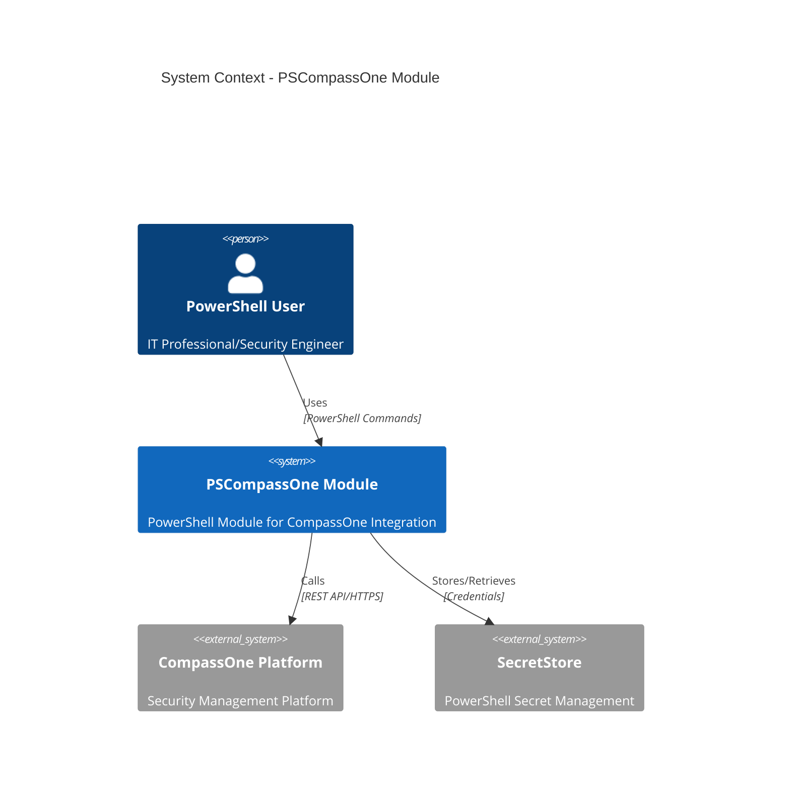
```mermaid
C4Context
    title System Context - PSCompassOne Module

    Person(user, "PowerShell User", "IT Professional/Security Engineer")
    System(psmodule, "PSCompassOne Module", "PowerShell Module for CompassOne Integration")
    System_Ext(compassone, "CompassOne Platform", "Security Management Platform")
    System_Ext(secretstore, "SecretStore", "PowerShell Secret Management")
    
    Rel(user, psmodule, "Uses", "PowerShell Commands")
    Rel(psmodule, compassone, "Calls", "REST API/HTTPS")
    Rel(psmodule, secretstore, "Stores/Retrieves", "Credentials")
    
    UpdateLayoutConfig($c4ShapeInRow="3", $c4BoundaryInRow="1")
```

### Container Diagram (Level 1)

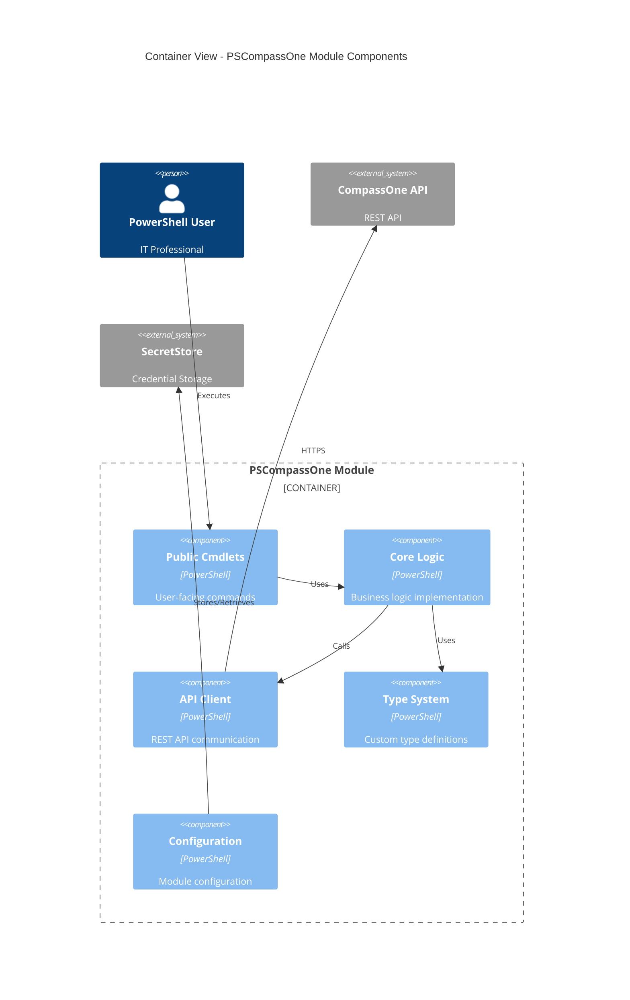
```mermaid
C4Container
    title Container View - PSCompassOne Module Components

    Person(user, "PowerShell User", "IT Professional")
    
    Container_Boundary(module, "PSCompassOne Module") {
        Component(cmdlets, "Public Cmdlets", "PowerShell", "User-facing commands")
        Component(core, "Core Logic", "PowerShell", "Business logic implementation")
        Component(api, "API Client", "PowerShell", "REST API communication")
        Component(types, "Type System", "PowerShell", "Custom type definitions")
        Component(config, "Configuration", "PowerShell", "Module configuration")
    }

    System_Ext(compassone, "CompassOne API", "REST API")
    System_Ext(secretstore, "SecretStore", "Credential Storage")

    Rel(user, cmdlets, "Executes")
    Rel(cmdlets, core, "Uses")
    Rel(core, api, "Calls")
    Rel(core, types, "Uses")
    Rel(api, compassone, "HTTPS")
    Rel(config, secretstore, "Stores/Retrieves")
    
    UpdateLayoutConfig($c4ShapeInRow="3", $c4BoundaryInRow="1")
```

## 2.2 Component Details

### Component Diagram (Level 2)

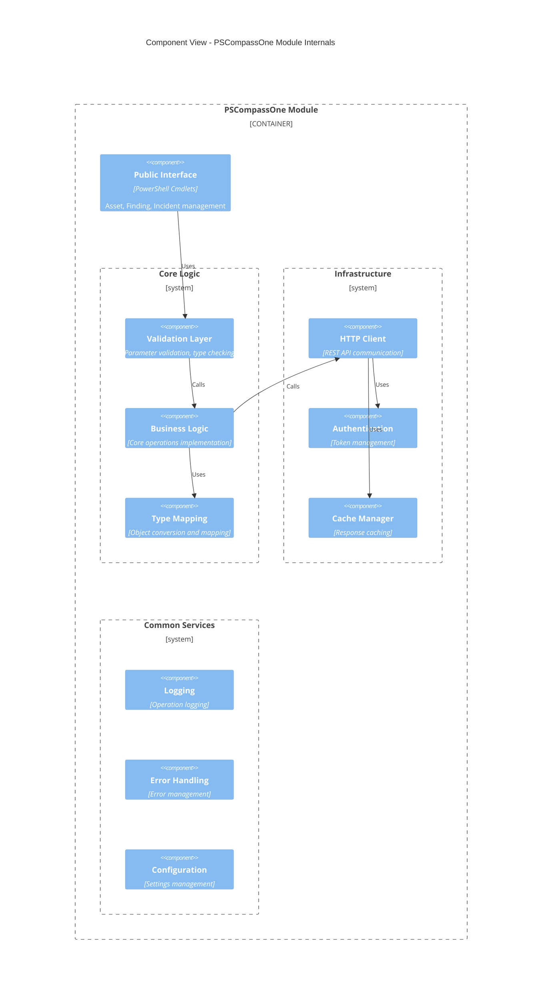
```mermaid
C4Component
    title Component View - PSCompassOne Module Internals

    Container_Boundary(module, "PSCompassOne Module") {
        Component(public, "Public Interface", "PowerShell Cmdlets", "Asset, Finding, Incident management") 
        
        Boundary(core, "Core Logic") {
            Component(validation, "Validation Layer", "Parameter validation, type checking")
            Component(business, "Business Logic", "Core operations implementation")
            Component(mapping, "Type Mapping", "Object conversion and mapping")
        }
        
        Boundary(infra, "Infrastructure") {
            Component(http, "HTTP Client", "REST API communication")
            Component(auth, "Authentication", "Token management")
            Component(cache, "Cache Manager", "Response caching")
        }
        
        Boundary(common, "Common Services") {
            Component(logging, "Logging", "Operation logging")
            Component(error, "Error Handling", "Error management")
            Component(config, "Configuration", "Settings management")
        }
    }

    Rel(public, validation, "Uses")
    Rel(validation, business, "Calls")
    Rel(business, mapping, "Uses")
    Rel(business, http, "Calls")
    Rel(http, auth, "Uses")
    Rel(http, cache, "Uses")
    
    UpdateLayoutConfig($c4ShapeInRow="4", $c4BoundaryInRow="2")
```

### Data Flow Diagram

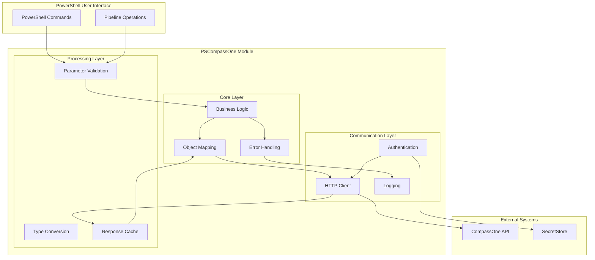
```mermaid
flowchart TB
    subgraph User["PowerShell User Interface"]
        CMD[PowerShell Commands]
        PIPE[Pipeline Operations]
    end

    subgraph Module["PSCompassOne Module"]
        subgraph Processing["Processing Layer"]
            VAL[Parameter Validation]
            CONV[Type Conversion]
            CACHE[Response Cache]
        end
        
        subgraph Core["Core Layer"]
            BUS[Business Logic]
            MAP[Object Mapping]
            ERR[Error Handling]
        end
        
        subgraph Communication["Communication Layer"]
            AUTH[Authentication]
            HTTP[HTTP Client]
            LOG[Logging]
        end
    end

    subgraph External["External Systems"]
        API[CompassOne API]
        SEC[SecretStore]
    end

    CMD --> VAL
    PIPE --> VAL
    VAL --> BUS
    BUS --> MAP
    MAP --> HTTP
    HTTP --> CACHE
    CACHE --> MAP
    AUTH --> HTTP
    HTTP --> API
    AUTH --> SEC
    BUS --> ERR
    ERR --> LOG
```

## 2.3 Technical Decisions

### Architecture Patterns

| Pattern | Implementation | Justification |
|---------|---------------|---------------|
| Layered Architecture | Separate cmdlet, business logic, and API layers | Clear separation of concerns, maintainability |
| Repository Pattern | Asset, Finding, and Relationship repositories | Consistent data access patterns |
| Factory Pattern | Type-specific object creation | Flexible object instantiation |
| Command Pattern | Cmdlet implementation | Standard PowerShell pattern |

### Communication Patterns

| Pattern | Usage | Benefits |
|---------|-------|----------|
| Synchronous REST | Primary API communication | Direct response handling |
| Pipeline Streaming | Large dataset processing | Memory efficiency |
| Event Sourcing | Operation logging | Audit trail, debugging |
| Circuit Breaker | API failure handling | Resilience, stability |

## 2.4 Cross-Cutting Concerns

### Deployment Diagram

```mermaid
deployment
    title PSCompassOne Module Deployment

    node "User Workstation" {
        component "PowerShell Runtime" {
            component "PSCompassOne Module"
            component "SecretStore Module"
        }
        artifact "Configuration" {
            file "Settings"
            file "Credentials"
        }
        artifact "Logs" {
            file "Operations Log"
            file "Error Log"
        }
    }

    node "CompassOne Platform" {
        component "REST API Gateway" {
            component "Authentication"
            component "Rate Limiting"
        }
        component "API Services"
    }

    PSCompassOne Module --> REST API Gateway : HTTPS
    PSCompassOne Module --> SecretStore Module : Credential Access
```

### Monitoring and Observability

| Aspect | Implementation | Metrics |
|--------|---------------|---------|
| Performance | Write-Verbose timing | Response times, throughput |
| Error Rates | Error stream logging | Failures, retries |
| Usage | Operation logging | Command frequency, patterns |
| Resources | Performance counters | Memory, CPU utilization |

### Security Architecture

| Layer | Mechanism | Implementation |
|-------|-----------|----------------|
| Transport | TLS 1.2+ | HTTPS communication |
| Authentication | API Keys | SecretStore integration |
| Authorization | Role-based | API-level enforcement |
| Audit | Event logging | Operation tracking |

# 3. SYSTEM COMPONENTS ARCHITECTURE

## 3.1 Command Line Interface Design

### 3.1.1 Command Structure

| Component | Pattern | Example |
|-----------|---------|---------|
| Verb | Approved PowerShell Verbs | Get, Set, New, Remove |
| Noun | Singular Entity Names | Asset, Finding, Incident |
| Parameters | PascalCase Names | -AssetId, -IncludeDeleted |
| Pipeline Support | ByValue, ByPropertyName | Get-Asset \| Set-Asset |

### 3.1.2 Input/Output Specifications

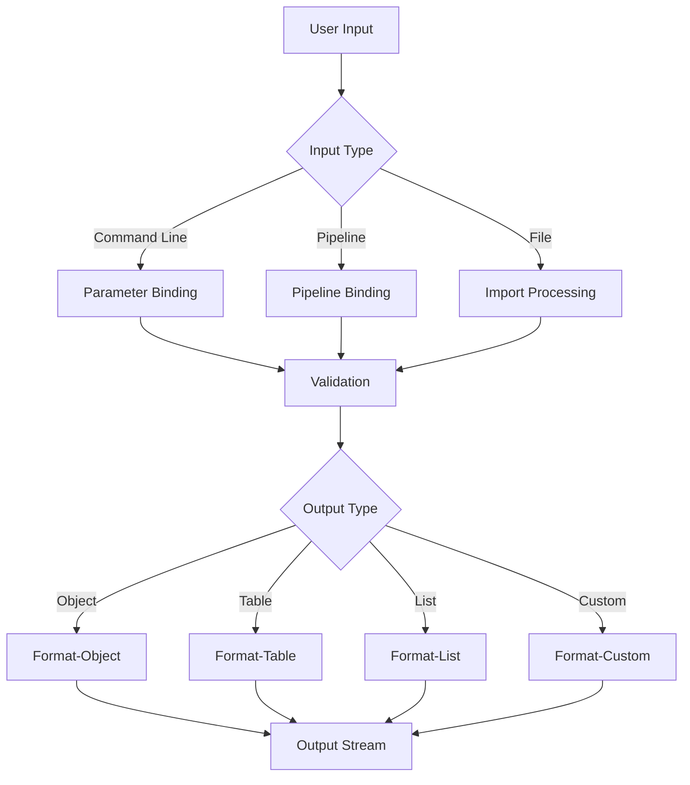
```mermaid
flowchart TD
    A[User Input] --> B{Input Type}
    B -->|Command Line| C[Parameter Binding]
    B -->|Pipeline| D[Pipeline Binding]
    B -->|File| E[Import Processing]
    
    C --> F[Validation]
    D --> F
    E --> F
    
    F --> G{Output Type}
    G -->|Object| H[Format-Object]
    G -->|Table| I[Format-Table]
    G -->|List| J[Format-List]
    G -->|Custom| K[Format-Custom]
    
    H --> L[Output Stream]
    I --> L
    J --> L
    K --> L
```

### 3.1.3 Error Handling

| Error Type | Handling Method | User Feedback |
|------------|----------------|---------------|
| Parameter Validation | Parameter Validation Attributes | Immediate error with suggestion |
| API Errors | Try/Catch with ErrorRecord | Formatted error with context |
| Pipeline Errors | Pipeline Error Stream | Error object with source |
| Authentication | Terminating Error | Clear authentication failure message |

### 3.1.4 Help System

| Component | Implementation | Example |
|-----------|---------------|---------|
| Command Help | Comment-Based Help | Get-Help Get-Asset |
| Parameter Help | Parameter Attributes | [Parameter(HelpMessage="Asset ID")] |
| Examples | Example Section | Get-Help Get-Asset -Examples |
| Online Help | URI Link | Get-Help Get-Asset -Online |

## 3.2 Data Storage Design

### 3.2.1 Configuration Storage Schema

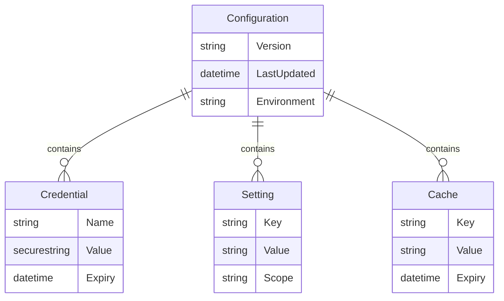
```mermaid
erDiagram
    Configuration ||--o{ Credential : contains
    Configuration ||--o{ Setting : contains
    Configuration ||--o{ Cache : contains
    
    Configuration {
        string Version
        datetime LastUpdated
        string Environment
    }
    
    Credential {
        string Name
        securestring Value
        datetime Expiry
    }
    
    Setting {
        string Key
        string Value
        string Scope
    }
    
    Cache {
        string Key
        string Value
        datetime Expiry
    }
```

### 3.2.2 Local Storage Structure

| Storage Type | Location | Format | Encryption |
|--------------|----------|--------|------------|
| Configuration | %APPDATA%\PSCompassOne | JSON | No |
| Credentials | SecretStore | SecureString | Yes |
| Cache | %TEMP%\PSCompassOne | JSON | No |
| Logs | %APPDATA%\PSCompassOne\Logs | Text | No |

### 3.2.3 Cache Management

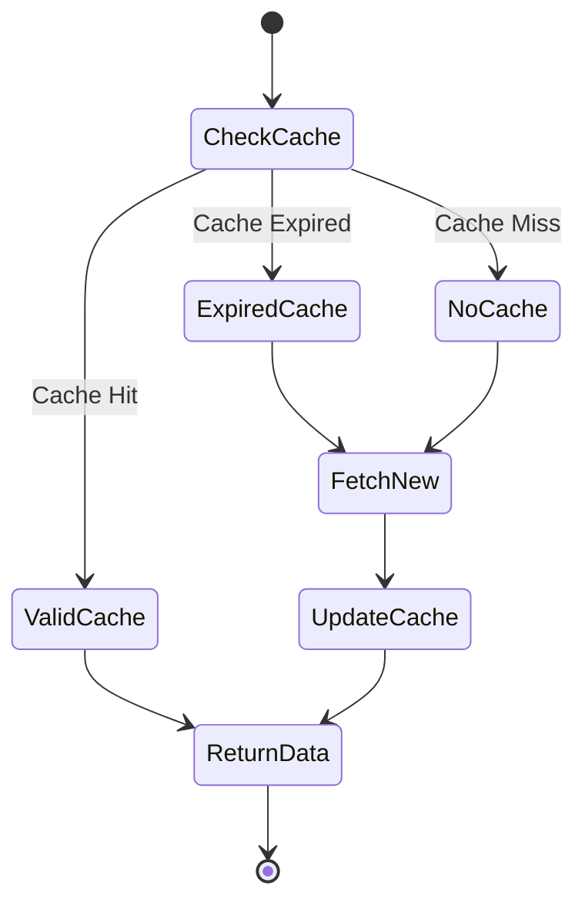
```mermaid
stateDiagram-v2
    [*] --> CheckCache
    CheckCache --> ValidCache: Cache Hit
    CheckCache --> ExpiredCache: Cache Expired
    CheckCache --> NoCache: Cache Miss
    
    ValidCache --> ReturnData
    ExpiredCache --> FetchNew
    NoCache --> FetchNew
    
    FetchNew --> UpdateCache
    UpdateCache --> ReturnData
    
    ReturnData --> [*]
```

## 3.3 API Integration Design

### 3.3.1 Authentication Flow

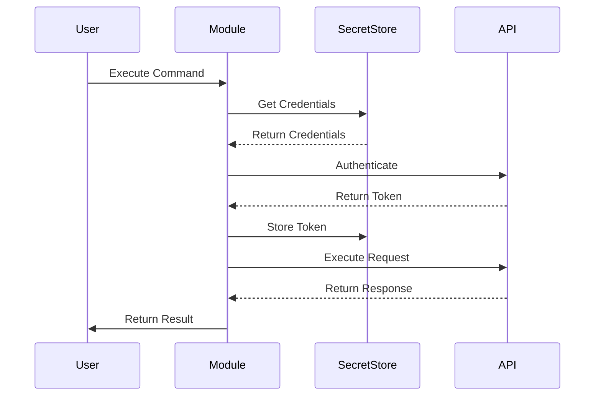
```mermaid
sequenceDiagram
    participant User
    participant Module
    participant SecretStore
    participant API
    
    User->>Module: Execute Command
    Module->>SecretStore: Get Credentials
    SecretStore-->>Module: Return Credentials
    Module->>API: Authenticate
    API-->>Module: Return Token
    Module->>SecretStore: Store Token
    Module->>API: Execute Request
    API-->>Module: Return Response
    Module->>User: Return Result
```

### 3.3.2 API Request/Response Structure

| Component | Format | Validation |
|-----------|--------|------------|
| Headers | JSON | Required fields |
| Authentication | Bearer Token | Token validity |
| Request Body | JSON | Schema validation |
| Response | JSON | Type checking |
| Errors | JSON | Error mapping |

### 3.3.3 Integration Patterns

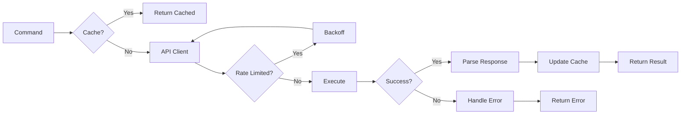
```mermaid
flowchart LR
    A[Command] --> B{Cache?}
    B -->|Yes| C[Return Cached]
    B -->|No| D[API Client]
    
    D --> E{Rate Limited?}
    E -->|Yes| F[Backoff]
    E -->|No| G[Execute]
    
    F --> D
    G --> H{Success?}
    
    H -->|Yes| I[Parse Response]
    H -->|No| J[Handle Error]
    
    I --> K[Update Cache]
    K --> L[Return Result]
    J --> M[Return Error]
```

### 3.3.4 API Security Controls

| Control | Implementation | Validation |
|---------|---------------|------------|
| Transport | TLS 1.2+ | Certificate validation |
| Authentication | Bearer Token | Token expiration check |
| Authorization | Role-based | Permission validation |
| Rate Limiting | Exponential backoff | Request tracking |
| Input Validation | Schema validation | Parameter checking |

## 3.4 Cross-Cutting Concerns

### 3.4.1 Logging Architecture

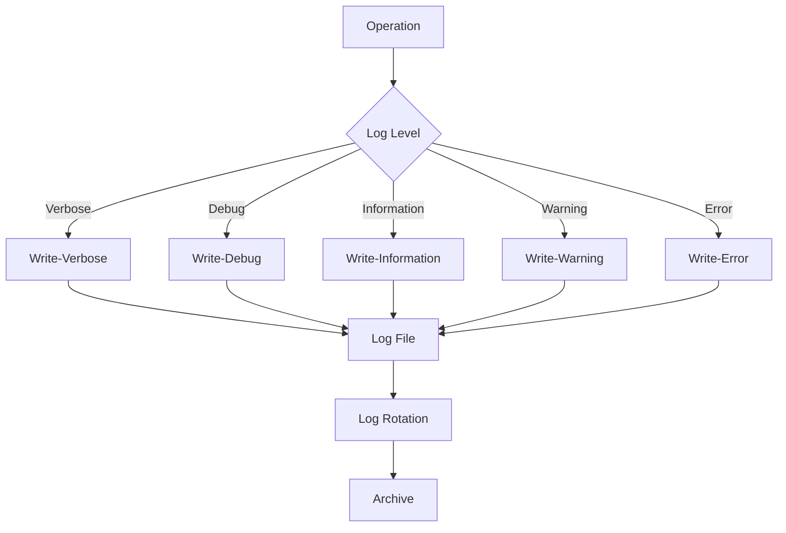
```mermaid
flowchart TD
    A[Operation] --> B{Log Level}
    B -->|Verbose| C[Write-Verbose]
    B -->|Debug| D[Write-Debug]
    B -->|Information| E[Write-Information]
    B -->|Warning| F[Write-Warning]
    B -->|Error| G[Write-Error]
    
    C --> H[Log File]
    D --> H
    E --> H
    F --> H
    G --> H
    
    H --> I[Log Rotation]
    I --> J[Archive]
```

### 3.4.2 Performance Optimization

| Component | Strategy | Metrics |
|-----------|----------|---------|
| Caching | In-memory + file | Cache hit ratio > 80% |
| Batch Operations | Bulk API requests | < 100ms per item |
| Connection Pooling | HTTP client reuse | < 10 connections |
| Resource Management | Dispose pattern | No memory leaks |

### 3.4.3 Error Recovery

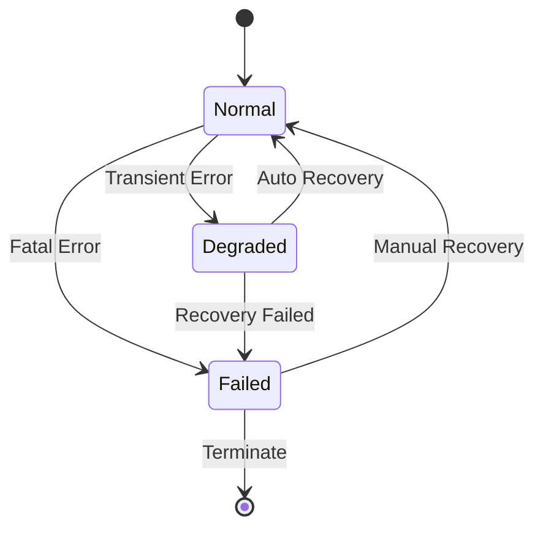
```mermaid
stateDiagram-v2
    [*] --> Normal
    Normal --> Degraded: Transient Error
    Normal --> Failed: Fatal Error
    Degraded --> Normal: Auto Recovery
    Degraded --> Failed: Recovery Failed
    Failed --> Normal: Manual Recovery
    Failed --> [*]: Terminate
```

### 3.4.4 Monitoring and Diagnostics

| Metric | Collection Method | Threshold |
|--------|------------------|-----------|
| Response Time | Operation timing | < 2s |
| Error Rate | Error stream | < 5% |
| Memory Usage | Performance counter | < 500MB |
| API Calls | Request counter | < 1000/hr |
| Cache Hits | Cache metrics | > 80% |

# 4. TECHNOLOGY STACK

## 4.1 PROGRAMMING LANGUAGES

### Primary Languages

| Language | Version | Usage | Justification |
|----------|---------|-------|---------------|
| PowerShell | 5.1, 7.x+ | Core Module Development | - Native PowerShell module development<br>- Cross-platform compatibility<br>- Built-in pipeline support |
| C# | 6.0+ | Compiled Cmdlets | - Performance-critical operations<br>- Complex type handling<br>- Strong .NET integration |

### Supporting Languages

| Language | Version | Usage | Justification |
|----------|---------|-------|---------------|
| JSON | - | Data Exchange | - API communication<br>- Configuration storage<br>- Standard serialization |
| Markdown | - | Documentation | - Standard help format<br>- GitHub compatibility<br>- Generated documentation |

## 4.2 FRAMEWORKS & LIBRARIES

### Core Frameworks

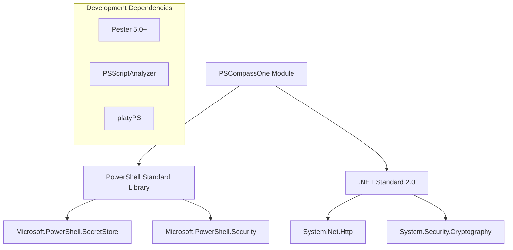
```mermaid
flowchart TD
    A[PSCompassOne Module] --> B[PowerShell Standard Library]
    A --> C[.NET Standard 2.0]
    
    B --> D[Microsoft.PowerShell.SecretStore]
    B --> E[Microsoft.PowerShell.Security]
    
    C --> F[System.Net.Http]
    C --> G[System.Security.Cryptography]
    
    subgraph "Development Dependencies"
        H[Pester 5.0+]
        I[PSScriptAnalyzer]
        J[platyPS]
    end
```

### Required Libraries

| Library | Version | Purpose | Justification |
|---------|---------|---------|---------------|
| Microsoft.PowerShell.SecretStore | 1.0.0+ | Credential Storage | - Secure credential management<br>- Cross-platform support<br>- Standard PowerShell integration |
| Microsoft.PowerShell.Security | Built-in | Security Operations | - Certificate handling<br>- Encryption support<br>- Security policy enforcement |
| System.Net.Http | Built-in | API Communication | - Modern HTTP client<br>- TLS 1.2+ support<br>- Efficient connection handling |

## 4.3 DATABASES & STORAGE

### Local Storage Architecture

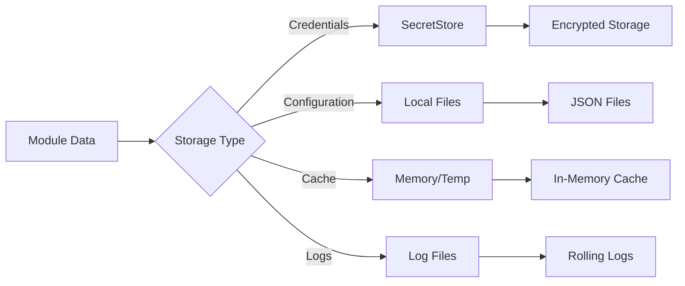
```mermaid
flowchart LR
    A[Module Data] --> B{Storage Type}
    
    B -->|Credentials| C[SecretStore]
    B -->|Configuration| D[Local Files]
    B -->|Cache| E[Memory/Temp]
    B -->|Logs| F[Log Files]
    
    C --> G[Encrypted Storage]
    D --> H[JSON Files]
    E --> I[In-Memory Cache]
    F --> J[Rolling Logs]
```

### Storage Solutions

| Type | Implementation | Purpose | Location |
|------|---------------|---------|-----------|
| Credentials | SecretStore | Secure token storage | System-protected store |
| Configuration | JSON files | Module settings | %APPDATA%/PSCompassOne |
| Cache | In-memory + files | Performance optimization | Memory + %TEMP% |
| Logs | Text files | Audit and debugging | %APPDATA%/PSCompassOne/logs |

## 4.4 THIRD-PARTY SERVICES

### External Dependencies

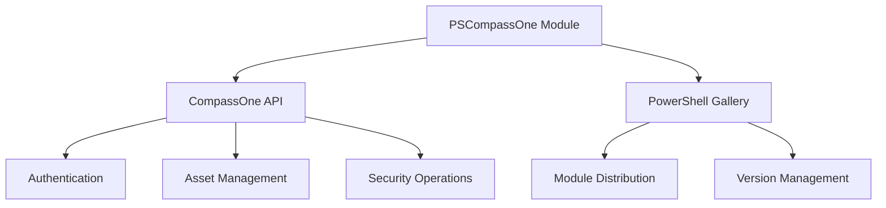
```mermaid
flowchart TD
    A[PSCompassOne Module] --> B[CompassOne API]
    A --> C[PowerShell Gallery]
    
    B --> D[Authentication]
    B --> E[Asset Management]
    B --> F[Security Operations]
    
    C --> G[Module Distribution]
    C --> H[Version Management]
```

### Service Integration

| Service | Purpose | Integration Method |
|---------|---------|-------------------|
| CompassOne API | Core Platform Access | REST API over HTTPS |
| PowerShell Gallery | Module Distribution | NuGet Package |
| SecretStore | Credential Management | PowerShell Module |

## 4.5 DEVELOPMENT & DEPLOYMENT

### Development Environment

| Tool | Version | Purpose |
|------|---------|---------|
| VS Code | Latest | Primary IDE |
| PowerShell Extension | Latest | PowerShell Development |
| Git | Latest | Version Control |
| Pester | 5.0+ | Testing Framework |

### Build Pipeline

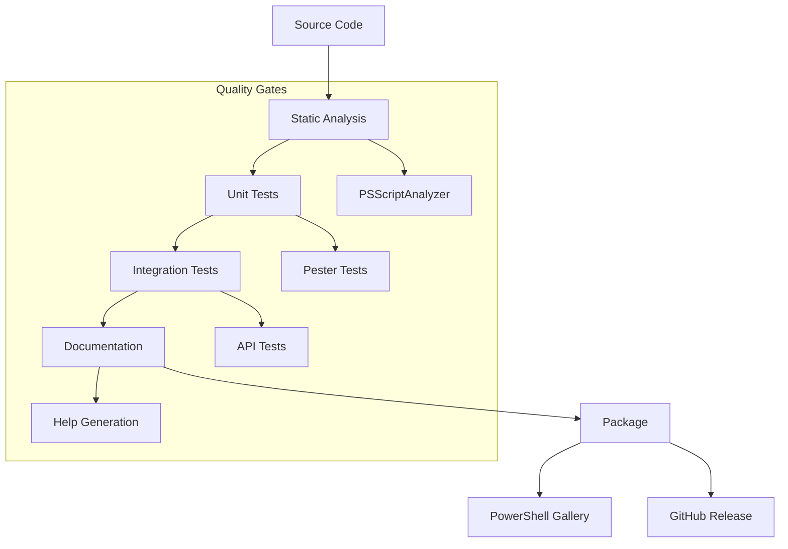
```mermaid
flowchart TD
    A[Source Code] --> B[Static Analysis]
    B --> C[Unit Tests]
    C --> D[Integration Tests]
    D --> E[Documentation]
    E --> F[Package]
    
    subgraph "Quality Gates"
        B --> G[PSScriptAnalyzer]
        C --> H[Pester Tests]
        D --> I[API Tests]
        E --> J[Help Generation]
    end
    
    F --> K[PowerShell Gallery]
    F --> L[GitHub Release]
```

### Deployment Requirements

| Requirement | Implementation | Validation |
|-------------|---------------|------------|
| Cross-Platform | PowerShell 5.1+ compatibility | Platform-specific tests |
| Dependencies | Automatic module installation | Dependency validation |
| Versioning | Semantic versioning | Version comparison |
| Documentation | Generated help files | Help validation |

### CI/CD Architecture

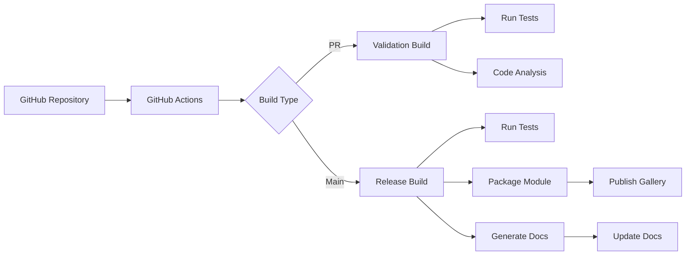
```mermaid
flowchart LR
    A[GitHub Repository] --> B[GitHub Actions]
    
    B --> C{Build Type}
    C -->|PR| D[Validation Build]
    C -->|Main| E[Release Build]
    
    D --> F[Run Tests]
    D --> G[Code Analysis]
    
    E --> H[Run Tests]
    E --> I[Package Module]
    E --> J[Generate Docs]
    
    I --> K[Publish Gallery]
    J --> L[Update Docs]
```

## 5. SYSTEM DESIGN

### 5.1 Module Architecture

#### 5.1.1 High-Level Architecture

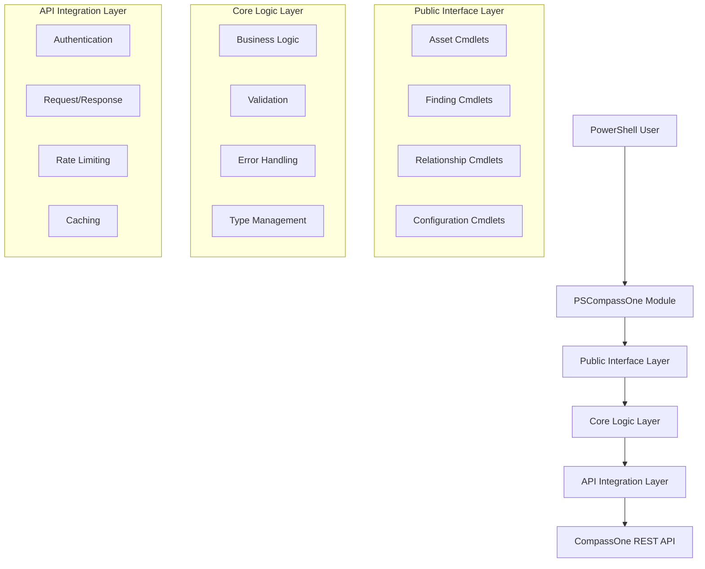
```mermaid
flowchart TD
    A[PowerShell User] --> B[PSCompassOne Module]
    B --> C[Public Interface Layer]
    C --> D[Core Logic Layer]
    D --> E[API Integration Layer]
    E --> F[CompassOne REST API]
    
    subgraph "Public Interface Layer"
        C1[Asset Cmdlets]
        C2[Finding Cmdlets]
        C3[Relationship Cmdlets]
        C4[Configuration Cmdlets]
    end
    
    subgraph "Core Logic Layer"
        D1[Business Logic]
        D2[Validation]
        D3[Error Handling]
        D4[Type Management]
    end
    
    subgraph "API Integration Layer"
        E1[Authentication]
        E2[Request/Response]
        E3[Rate Limiting]
        E4[Caching]
    end
```

#### 5.1.2 Component Interaction

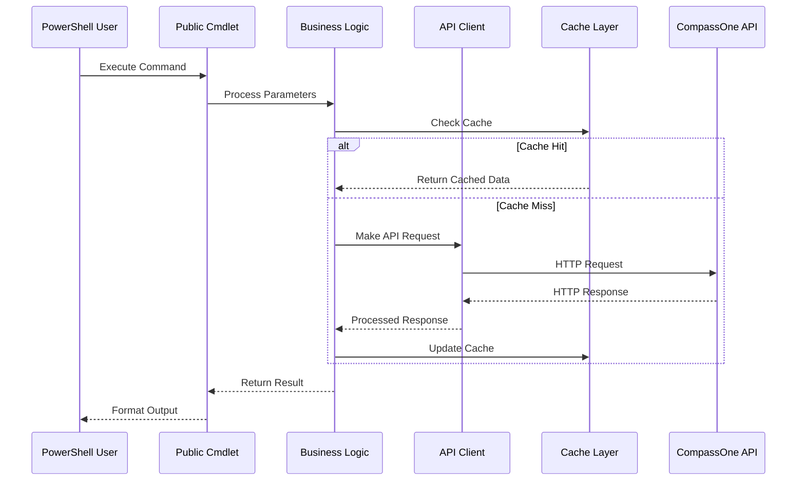
```mermaid
sequenceDiagram
    participant User as PowerShell User
    participant Cmdlet as Public Cmdlet
    participant Logic as Business Logic
    participant API as API Client
    participant Cache as Cache Layer
    participant REST as CompassOne API
    
    User->>Cmdlet: Execute Command
    Cmdlet->>Logic: Process Parameters
    Logic->>Cache: Check Cache
    
    alt Cache Hit
        Cache-->>Logic: Return Cached Data
    else Cache Miss
        Logic->>API: Make API Request
        API->>REST: HTTP Request
        REST-->>API: HTTP Response
        API-->>Logic: Processed Response
        Logic->>Cache: Update Cache
    end
    
    Logic-->>Cmdlet: Return Result
    Cmdlet-->>User: Format Output
```

### 5.2 Command Line Interface Design

#### 5.2.1 Command Structure

| Command Pattern | Example | Description |
|----------------|---------|-------------|
| Get-PSCompassOneEntity | `Get-PSCompassOneAsset -Id "123"` | Retrieves entities with filtering |
| New-PSCompassOneEntity | `New-PSCompassOneAsset -Name "TestDevice"` | Creates new entities |
| Set-PSCompassOneEntity | `Set-PSCompassOneAsset -Id "123" -Status "Active"` | Updates existing entities |
| Remove-PSCompassOneEntity | `Remove-PSCompassOneAsset -Id "123"` | Deletes entities |

#### 5.2.2 Parameter Sets

```powershell
[CmdletBinding(DefaultParameterSetName = 'List')]
param(
    [Parameter(ParameterSetName = 'Get', Mandatory = $true, Position = 0)]
    [string]$Id,
    
    [Parameter(ParameterSetName = 'List')]
    [int]$PageSize = 50,
    
    [Parameter(ParameterSetName = 'List')]
    [int]$Page = 1,
    
    [Parameter(ParameterSetName = 'List')]
    [string]$SortBy,
    
    [Parameter(ParameterSetName = 'List')]
    [ValidateSet('ASC', 'DESC')]
    [string]$SortOrder = 'ASC'
)
```

### 5.3 Data Storage Design

#### 5.3.1 Configuration Storage Schema


```mermaid
erDiagram
    Configuration ||--o{ Credential : contains
    Configuration ||--o{ Setting : contains
    Configuration ||--o{ Cache : contains
    
    Configuration {
        string Version
        datetime LastUpdated
        string Environment
    }
    
    Credential {
        string Name
        securestring Value
        datetime Expiry
    }
    
    Setting {
        string Key
        string Value
        string Scope
    }
    
    Cache {
        string Key
        string Value
        datetime Expiry
    }
```

#### 5.3.2 Storage Locations

| Storage Type | Location | Format | Encryption |
|--------------|----------|--------|------------|
| Configuration | %APPDATA%\PSCompassOne | JSON | No |
| Credentials | SecretStore | SecureString | Yes |
| Cache | %TEMP%\PSCompassOne | JSON | No |
| Logs | %APPDATA%\PSCompassOne\Logs | Text | No |

### 5.4 API Integration Design

#### 5.4.1 Request/Response Flow

```mermaid
flowchart LR
    A[Command] --> B{Cache?}
    B -->|Yes| C[Return Cached]
    B -->|No| D[API Client]
    
    D --> E{Rate Limited?}
    E -->|Yes| F[Backoff]
    E -->|No| G[Execute]
    
    F --> D
    G --> H{Success?}
    
    H -->|Yes| I[Parse Response]
    H -->|No| J[Handle Error]
    
    I --> K[Update Cache]
    K --> L[Return Result]
    J --> M[Return Error]
```

#### 5.4.2 Authentication Flow

```mermaid
sequenceDiagram
    participant User
    participant Module
    participant SecretStore
    participant API
    
    User->>Module: Execute Command
    Module->>SecretStore: Get Credentials
    SecretStore-->>Module: Return Credentials
    Module->>API: Authenticate
    API-->>Module: Return Token
    Module->>SecretStore: Store Token
    Module->>API: Execute Request
    API-->>Module: Return Response
    Module->>User: Return Result
```

#### 5.4.3 API Security Controls

| Control | Implementation | Validation |
|---------|---------------|------------|
| Transport | TLS 1.2+ | Certificate validation |
| Authentication | Bearer Token | Token expiration check |
| Authorization | Role-based | Permission validation |
| Rate Limiting | Exponential backoff | Request tracking |
| Input Validation | Schema validation | Parameter checking |

### 5.5 Error Handling Design

#### 5.5.1 Error Flow

```mermaid
flowchart TD
    A[Operation] --> B{Error Type}
    B -->|Validation| C[Parameter Error]
    B -->|API| D[API Error]
    B -->|Authentication| E[Auth Error]
    B -->|System| F[System Error]
    
    C --> G[Write-Error]
    D --> H{Retryable?}
    E --> I[ThrowTerminating]
    F --> J[Write-Error]
    
    H -->|Yes| K[Retry Logic]
    H -->|No| L[Write-Error]
    
    K --> M{Retry Success?}
    M -->|Yes| N[Continue]
    M -->|No| O[Write-Error]
```

#### 5.5.2 Error Categories

| Error Type | Handling | Recovery |
|------------|----------|----------|
| Validation | Parameter validation | User correction |
| API | Retry with backoff | Automatic retry |
| Authentication | Token refresh | Automatic refresh |
| System | Exception handling | Manual intervention |

# 6. USER INTERFACE DESIGN

## 6.1 PowerShell Console Interface

### 6.1.1 Command Line Interface Elements

```
+----------------------------------------------------------+
|  PS C:\> Get-PSCompassOneAsset                            |
|                                                           |
|  ID        Name         Status    LastSeen                |
|  ----      ----        -------   --------                 |
|  abc123    WebServer1   Active    2024-01-20 13:45:00    |
|  def456    DbServer2    Inactive  2024-01-19 08:30:00    |
|  [More] or [Q] to quit                                    |
+----------------------------------------------------------+
```

### 6.1.2 Progress Indicators

```
+----------------------------------------------------------+
|  Retrieving assets...                                     |
|  [=====================================>     ] 75%        |
|  Processing page 3 of 4                                   |
|  [ESC] to cancel                                         |
+----------------------------------------------------------+
```

### 6.1.3 Interactive Prompts

```
+----------------------------------------------------------+
|  Confirm                                                  |
|  Are you sure you want to delete asset 'WebServer1'?      |
|  [Y] Yes  [N] No  [A] Yes to All  [L] No to All         |
|  [S] Suspend  [?] Help (default is "Y"):                 |
+----------------------------------------------------------+
```

### 6.1.4 Help Display

```
+----------------------------------------------------------+
|  Get-PSCompassOneAsset                                    |
|                                                           |
|  SYNTAX                                                   |
|    Get-PSCompassOneAsset [-Id <string>]                  |
|    Get-PSCompassOneAsset [-Filter <hashtable>]           |
|                                                           |
|  PARAMETERS                                              |
|    -Id <string>                                          |
|        The unique identifier of the asset                |
|                                                          |
|    -Filter <hashtable>                                   |
|        Filter criteria for asset search                  |
|                                                          |
|  EXAMPLES                                                |
|    Get-PSCompassOneAsset -Id "abc123"                   |
|    Get-PSCompassOneAsset -Filter @{status='active'}     |
+----------------------------------------------------------+
```

## 6.2 Grid View Interface

### 6.2.1 Asset Grid View

```
+----------------------------------------------------------+
|  Asset Grid View                              [x] Close   |
+----------------------------------------------------------+
|  [Search Assets...]        [Filter v]         [Export]    |
|----------------------------------------------------------+
|  [ ] Select  Name         Type      Status    Tags        |
|  [x] WebServer1  Server   Active    [Prod]               |
|  [ ] DbServer2   Database Inactive  [Dev,SQL]            |
|  [ ] Router01    Network  Active    [Network]            |
|----------------------------------------------------------+
|  Selected: 1 of 3    [Refresh]   [Delete]   [Edit]       |
+----------------------------------------------------------+
```

### 6.2.2 Relationship View

```
+----------------------------------------------------------+
|  Relationship Explorer                        [x] Close   |
+----------------------------------------------------------+
|  Source: WebServer1                                      |
|  +-- Connects to                                         |
|      +-- DbServer2                                       |
|      |   +-- Type: Database                             |
|      |   +-- Status: Active                             |
|      +-- Router01                                        |
|          +-- Type: Network                              |
|          +-- Status: Active                             |
|                                                          |
|  [Add Relationship]  [Remove]  [Export]                  |
+----------------------------------------------------------+
```

## 6.3 UI Component Key

### Symbols
- [x] = Close/Delete button or selected checkbox
- [v] = Dropdown menu
- [...] = Text input field
- [+] = Add/Create button
- [>] = Expand/Navigate
- [====] = Progress bar
- [ ] = Checkbox (unchecked)
- [Button] = Action button

### Borders
- +--+ = Window/Dialog corners
- |  | = Vertical borders
- ---- = Horizontal borders
- +-- = Tree view hierarchy

### Interactive Elements
- [More] = Continuation prompt
- [Y/N] = Yes/No choices
- [Search...] = Search input field
- [Filter v] = Filter dropdown

## 6.4 Navigation Flows

```mermaid
flowchart TD
    A[Command Line] --> B{Action Type}
    B -->|View| C[Grid View]
    B -->|Edit| D[Interactive Prompt]
    B -->|Help| E[Help Display]
    
    C --> F[Selection]
    F --> G[Bulk Actions]
    
    D --> H[Confirmation]
    H --> I[Progress Display]
    
    E --> J[Detailed Help]
    J --> K[Examples]
```

## 6.5 Error Display

```
+----------------------------------------------------------+
|  [!] Error                                                |
|  Failed to retrieve asset 'WebServer1'                    |
|                                                          |
|  Details:                                                |
|  - API returned 404 Not Found                            |
|  - Asset may have been deleted                           |
|                                                          |
|  Suggestions:                                            |
|  - Verify asset ID                                       |
|  - Check connection status                               |
|  - Try refreshing asset list                             |
|                                                          |
|  [Get Help]  [Retry]  [Cancel]                           |
+----------------------------------------------------------+
```

## 6.6 Warning Display

```
+----------------------------------------------------------+
|  [!] Warning                                              |
|  Operation will affect multiple assets (5)                |
|                                                          |
|  Impact:                                                 |
|  - Status changes                                        |
|  - Relationship updates                                  |
|  - Tag modifications                                     |
|                                                          |
|  [Show Details]  [Continue]  [Cancel]                    |
+----------------------------------------------------------+
```

## 6.7 Success Confirmation

```
+----------------------------------------------------------+
|  [i] Success                                              |
|  Operation completed successfully                         |
|                                                          |
|  Summary:                                                |
|  - 3 assets updated                                      |
|  - 2 relationships created                               |
|  - 1 tag added                                           |
|                                                          |
|  [View Results]  [Close]                                 |
+----------------------------------------------------------+
```

# 7. SECURITY CONSIDERATIONS

## 7.1 AUTHENTICATION AND AUTHORIZATION

### 7.1.1 Authentication Flow

```mermaid
sequenceDiagram
    participant User as PowerShell User
    participant Module as PSCompassOne Module
    participant Store as SecretStore
    participant API as CompassOne API

    User->>Module: Execute Command
    Module->>Store: Get API Token
    alt Token Found
        Store-->>Module: Return Token
    else No Token
        Module->>User: Request Credentials
        User->>Module: Provide API Key
        Module->>Store: Store Token
    end
    Module->>API: Authenticate Request
    API-->>Module: Validate Token
    Module->>User: Return Result
```

### 7.1.2 Authorization Controls

| Level | Implementation | Validation |
|-------|---------------|------------|
| Module Level | PowerShell Execution Policy | Requires AllSigned or RemoteSigned |
| API Level | Bearer Token Authentication | Token validation on each request |
| Command Level | Role-Based Access Control | API permission validation |
| Resource Level | Tenant Isolation | Customer/Account ID validation |

## 7.2 DATA SECURITY

### 7.2.1 Data Protection Measures

```mermaid
flowchart TD
    A[Sensitive Data] --> B{Storage Type}
    B -->|Credentials| C[SecretStore]
    B -->|Configuration| D[Encrypted Files]
    B -->|Runtime| E[Memory Protection]
    
    C --> F[AES-256 Encryption]
    D --> G[DPAPI Encryption]
    E --> H[SecureString]
    
    F --> I[Protected Storage]
    G --> I
    H --> J[Secure Memory]
```

### 7.2.2 Data Classification

| Data Type | Classification | Protection Method | Storage Location |
|-----------|---------------|-------------------|------------------|
| API Keys | High Sensitivity | AES-256 Encryption | SecretStore |
| Configuration | Medium Sensitivity | DPAPI Encryption | Local Files |
| Audit Logs | Low Sensitivity | Access Control | Log Files |
| Cache Data | Temporary | Memory Protection | Runtime Memory |

## 7.3 SECURITY PROTOCOLS

### 7.3.1 Communication Security

| Protocol | Implementation | Version | Purpose |
|----------|---------------|---------|----------|
| TLS | Required | 1.2+ | API Communication |
| HTTPS | Required | 1.1+ | Web Requests |
| Certificate Validation | Required | - | Server Authentication |
| HTTP Security Headers | Required | - | Response Protection |

### 7.3.2 Error Handling Security

```mermaid
flowchart LR
    A[Error Occurs] --> B{Error Type}
    B -->|Authentication| C[Secure Error]
    B -->|Authorization| D[Secure Error]
    B -->|Validation| E[Standard Error]
    B -->|System| F[Generic Error]
    
    C --> G[Remove Sensitive Data]
    D --> G
    E --> H[Filter Stack Trace]
    F --> H
    
    G --> I[Log Error]
    H --> I
    
    I --> J[Return Safe Message]
```

### 7.3.3 Security Controls

| Control Type | Implementation | Monitoring |
|--------------|---------------|------------|
| Rate Limiting | Exponential Backoff | Request Counting |
| Input Validation | Parameter Validation | Invalid Input Logging |
| Output Encoding | HTML/JSON Encoding | Response Scanning |
| Session Management | Token Refresh | Session Tracking |

### 7.3.4 Security Monitoring

```mermaid
flowchart TD
    A[Security Events] --> B{Event Type}
    B -->|Authentication| C[Auth Log]
    B -->|Authorization| D[Access Log]
    B -->|Operation| E[Audit Log]
    B -->|Error| F[Error Log]
    
    C --> G[Security Analysis]
    D --> G
    E --> G
    F --> G
    
    G --> H[Alert Generation]
    H --> I[Response Action]
```

### 7.3.5 Compliance Requirements

| Requirement | Implementation | Validation |
|-------------|---------------|------------|
| Audit Logging | Write-SecurityLog | Log integrity checks |
| Access Control | Role-based permissions | Permission validation |
| Data Privacy | Data minimization | PII scanning |
| Secure Storage | Encryption at rest | Storage scanning |

### 7.3.6 Security Best Practices

| Category | Practice | Implementation |
|----------|----------|----------------|
| Code Security | Code signing | SignTool for module files |
| Dependency Security | Version control | Dependency scanning |
| Runtime Security | Memory protection | SecureString usage |
| Network Security | Request validation | SSL/TLS validation |

### 7.3.7 Incident Response

```mermaid
flowchart LR
    A[Security Event] --> B{Severity}
    B -->|High| C[Immediate Action]
    B -->|Medium| D[Scheduled Action]
    B -->|Low| E[Logged Action]
    
    C --> F[Block Operation]
    D --> G[Warning Message]
    E --> H[Log Entry]
    
    F --> I[Incident Report]
    G --> I
    H --> I
```

## 8. INFRASTRUCTURE

### 8.1 DEPLOYMENT ENVIRONMENT

```mermaid
flowchart TD
    A[PSCompassOne Module] --> B{Deployment Target}
    B -->|Local| C[Developer Workstation]
    B -->|Enterprise| D[Corporate Environment]
    B -->|Cloud| E[Cloud Environment]
    
    C --> C1[PowerShell 5.1+]
    C --> C2[VS Code]
    C --> C3[Git]
    
    D --> D1[PowerShell 7.x]
    D --> D2[Group Policy]
    D --> D3[SCCM]
    
    E --> E1[Azure Automation]
    E --> E2[AWS Systems Manager]
    E --> E3[GCP Cloud Functions]
```

| Environment Type | Requirements | Configuration |
|-----------------|--------------|---------------|
| Local Development | - PowerShell 5.1 or 7.x<br>- VS Code + Extensions<br>- Git | - Local configuration files<br>- SecretStore vault<br>- Development certificates |
| Enterprise | - PowerShell 7.x<br>- SCCM/Intune<br>- Group Policy | - Centralized configuration<br>- Enterprise certificates<br>- Proxy settings |
| Cloud | - PowerShell 7.x<br>- Cloud runtime<br>- Managed identities | - Cloud configuration<br>- Service principals<br>- Cloud secrets management |

### 8.2 CLOUD SERVICES

| Service | Provider | Purpose | Justification |
|---------|----------|---------|---------------|
| Azure Key Vault | Microsoft | Secrets Management | - Enterprise-grade security<br>- PowerShell native integration<br>- Cross-platform support |
| AWS Systems Manager | AWS | Automation Execution | - PowerShell execution environment<br>- Parameter Store integration<br>- Cross-account access |
| Azure Automation | Microsoft | Scheduled Operations | - PowerShell-first platform<br>- Managed execution<br>- Enterprise integration |

### 8.3 CONTAINERIZATION

```mermaid
flowchart LR
    A[Base Image] --> B[PowerShell Image]
    B --> C[PSCompassOne Image]
    
    subgraph "Container Components"
        C --> D[PowerShell 7.x]
        C --> E[Required Modules]
        C --> F[Configuration]
    end
    
    subgraph "Volume Mounts"
        G[Secrets]
        H[Logs]
        I[Custom Scripts]
    end
    
    C --> G
    C --> H
    C --> I
```

#### Container Specifications

| Component | Version | Purpose |
|-----------|---------|---------|
| Base Image | mcr.microsoft.com/powershell:7.3 | Minimal PowerShell runtime |
| Required Modules | Latest | SecretStore, PSScriptAnalyzer |
| Configuration | Environment Variables | Runtime configuration |
| Volume Mounts | Named Volumes | Persistent storage |

### 8.4 ORCHESTRATION

```mermaid
flowchart TD
    A[Kubernetes Deployment] --> B[Pod Template]
    B --> C[PSCompassOne Container]
    B --> D[Secrets Container]
    
    C --> E[ConfigMap]
    C --> F[Secrets]
    
    subgraph "K8s Resources"
        E[ConfigMap]
        F[Secrets]
        G[PersistentVolume]
    end
    
    C --> G
    D --> F
```

#### Kubernetes Resources

| Resource | Purpose | Configuration |
|----------|---------|---------------|
| Deployment | Container management | Replicas, update strategy |
| ConfigMap | Configuration | Environment variables, settings |
| Secrets | Sensitive data | API keys, certificates |
| PersistentVolume | Storage | Logs, state data |

### 8.5 CI/CD PIPELINE

```mermaid
flowchart LR
    A[Source Code] --> B[Build Stage]
    B --> C[Test Stage]
    C --> D[Package Stage]
    D --> E[Deploy Stage]
    
    subgraph "Build"
        B1[Lint Code]
        B2[Compile Resources]
        B3[Generate Docs]
    end
    
    subgraph "Test"
        C1[Unit Tests]
        C2[Integration Tests]
        C3[Security Scan]
    end
    
    subgraph "Package"
        D1[Create Module]
        D2[Sign Code]
        D3[Create Container]
    end
    
    subgraph "Deploy"
        E1[Gallery Publish]
        E2[Container Registry]
        E3[Documentation]
    end
    
    B --> B1 --> B2 --> B3
    C --> C1 --> C2 --> C3
    D --> D1 --> D2 --> D3
    E --> E1 --> E2 --> E3
```

#### Pipeline Stages

| Stage | Tools | Actions |
|-------|-------|---------|
| Build | - PSScriptAnalyzer<br>- platyPS<br>- VSCode Tasks | - Code analysis<br>- Documentation generation<br>- Resource compilation |
| Test | - Pester<br>- PSScriptAnalyzer<br>- Security tools | - Unit testing<br>- Integration testing<br>- Security scanning |
| Package | - PowerShellGet<br>- Docker<br>- SignTool | - Module packaging<br>- Container building<br>- Code signing |
| Deploy | - PowerShell Gallery<br>- Container Registry<br>- GitHub Pages | - Module publishing<br>- Container deployment<br>- Documentation updates |

#### GitHub Actions Workflow

```yaml
name: CI/CD Pipeline
on:
  push:
    branches: [ main ]
  pull_request:
    branches: [ main ]

jobs:
  build:
    runs-on: ubuntu-latest
    steps:
      - uses: actions/checkout@v2
      - name: Setup PowerShell
        uses: PowerShell/PowerShell@v1
      - name: Install dependencies
        run: |
          Install-Module PSScriptAnalyzer -Force
          Install-Module Pester -Force
      - name: Run tests
        run: Invoke-Pester
      - name: Build module
        run: ./build.ps1
      - name: Publish module
        if: github.ref == 'refs/heads/main'
        run: Publish-Module -Path ./output/PSCompassOne -NuGetApiKey ${{ secrets.PSGALLERY_API_KEY }}
```

# APPENDICES

## Additional Technical Information

### API Rate Limiting Implementation

```mermaid
flowchart TD
    A[API Request] --> B{Rate Limited?}
    B -->|No| C[Process Request]
    B -->|Yes| D[Calculate Backoff]
    D --> E[Wait Period]
    E --> F{Retry Count < Max?}
    F -->|Yes| A
    F -->|No| G[Throw Exception]
    C --> H[Return Result]
```

| Retry Attempt | Backoff Time | Max Wait |
|--------------|--------------|-----------|
| 1 | 2 seconds | 2 seconds |
| 2 | 4 seconds | 4 seconds |
| 3 | 8 seconds | 8 seconds |
| 4 | 16 seconds | 16 seconds |
| 5 | 32 seconds | 30 seconds |

### Asset Class Properties

| Asset Class | Required Properties | Optional Properties |
|------------|-------------------|-------------------|
| DEVICE | name, status, model | osName, osVersion, ips, macs |
| CONTAINER | name, status, image | ports, command, imageTag |
| SOFTWARE | name, status, version | license, urls, hipaa |
| USER | name, email, username | mfaEnabled, admin, group |
| PROCESS | name, pid, status | ppid, hash, userName |

## GLOSSARY

| Term | Definition |
|------|------------|
| Asset Relationship | A defined connection between two assets in the CompassOne platform |
| Bulk Operation | Processing multiple items in a single API call or command execution |
| Command Pipeline | PowerShell's mechanism for passing objects between commands |
| Finding Correlation | Process of linking related security findings together |
| Implicit Relationship | Automatically detected connection between assets |
| PowerShell Gallery | Microsoft's public repository for PowerShell modules |
| SecretStore | PowerShell's secure credential storage system |
| Tenant Isolation | Separation of data and access between different customers |
| Type System | PowerShell's object type management framework |
| Verb-Noun Pattern | Standard PowerShell command naming convention |

## ACRONYMS

| Acronym | Definition |
|---------|------------|
| API | Application Programming Interface |
| BYOD | Bring Your Own Device |
| CRUD | Create, Read, Update, Delete |
| DPAPI | Data Protection Application Programming Interface |
| FQDN | Fully Qualified Domain Name |
| HIPAA | Health Insurance Portability and Accountability Act |
| JSON | JavaScript Object Notation |
| MAC | Media Access Control |
| MFA | Multi-Factor Authentication |
| MVP | Minimum Viable Product |
| PID | Process Identifier |
| PPID | Parent Process Identifier |
| REST | Representational State Transfer |
| SIEM | Security Information and Event Management |
| SOC | Security Operations Center |
| SSL | Secure Sockets Layer |
| TLS | Transport Layer Security |
| UUID | Universally Unique Identifier |
| VPN | Virtual Private Network |
| YAML | YAML Ain't Markup Language |

## Development Environment Setup

```mermaid
flowchart LR
    A[Development Tools] --> B[VS Code]
    A --> C[PowerShell 7.x]
    A --> D[Git]
    
    B --> E[Extensions]
    E --> F[PowerShell]
    E --> G[PSScriptAnalyzer]
    E --> H[Git Lens]
    
    C --> I[Modules]
    I --> J[Pester]
    I --> K[platyPS]
    I --> L[SecretStore]
    
    D --> M[Source Control]
    M --> N[GitHub]
    N --> O[Actions]
    O --> P[CI/CD Pipeline]
```

## Module Dependencies

| Module | Version | Purpose | Source |
|--------|---------|---------|--------|
| Microsoft.PowerShell.SecretStore | 1.0.0+ | Credential storage | PowerShell Gallery |
| Pester | 5.0.0+ | Testing framework | PowerShell Gallery |
| PSScriptAnalyzer | 1.20.0+ | Code analysis | PowerShell Gallery |
| platyPS | 2.0.0+ | Documentation | PowerShell Gallery |
| PowerShellGet | 2.2.5+ | Module management | Built-in |
| Microsoft.PowerShell.Security | Built-in | Security functions | Built-in |